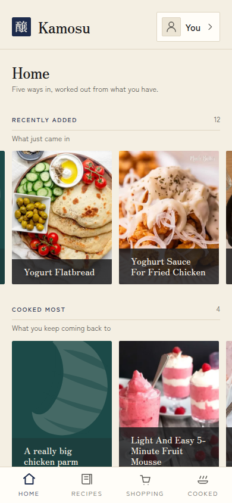

<p align="center">
  <picture>
    <source media="(prefers-color-scheme: dark)" srcset="docs/readme/wordmark-dark.png">
    
  </picture>
</p>

<p align="center">
  <a href="https://hub.docker.com/r/battermanz/kamosu"></a>
  <a href="Dockerfile"></a>
  <a href="#connecting-an-agent"></a>
  <a href="LICENSE"></a>
</p>

# Kamosu

**A self-hosted cookbook for the people you cook with. Everyone keeps their own
recipes, a Kitchen lets you cook from each other's, and your AI agent can do
everything you can.**

Kamosu keeps your recipes, every change ever made to them, each time someone
cooked one and how it went, and the shopping list for the dishes you picked
this week. Each person writes in their own Cookbook. Put the people you cook
with in a Kitchen, your household, your parents, a group of friends, and each
of you can open, cook and record how it went for everyone else's recipes,
while only the person who wrote a recipe can change it. Change someone else's,
and you get your own version of it, side by side with theirs.

Everything you can do in the web app, an agent can do over MCP (the Model
Context Protocol), because both are built from the same list of operations.
Kamosu runs on a machine you own, in one container with one folder and one
port, and it sends your data nowhere.

<table>
  <tr>
    <td width="50%" valign="top" align="center">
      
      <p align="center"><sub><b>Home</b>: shelves worked out from what you cook</sub></p>
    </td>
    <td width="50%" valign="top" align="center">
      
      <p align="center"><sub><b>A recipe</b>, with its whole history behind it</sub></p>
    </td>
  </tr>
  <tr>
    <td width="50%" valign="top" align="center">
      
      <p align="center"><sub><b>Cooking mode</b>: one step and what it uses</sub></p>
    </td>
    <td width="50%" valign="top" align="center">
      
      <p align="center"><sub><b>Shopping</b>, added up from the recipes you chose</sub></p>
    </td>
  </tr>
</table>

<details>
<summary><b>Contents</b></summary>

- [What you get](#what-you-get)
- [Kitchens and Cookbooks](#kitchens-and-cookbooks)
- [Who it is for](#who-it-is-for)
- [Quick start](#quick-start)
- [Connecting an agent](#connecting-an-agent)
- [Meaning Search](#meaning-search)
- [Your data](#your-data)
- [Configuration](#configuration)
- [Troubleshooting](#troubleshooting)
- [Security](#security)
- [Building from source](#building-from-source)
- [License](#license)

</details>

## What you get

- **Cook from your phone, offline.** Cooking mode walks you through the steps
  with the amounts each step needs, lets you tick off ingredients, and turns a
  time in the step text into a timer. Recipes stay readable with no signal, and
  what you record while offline is sent when the phone reconnects. Install it
  to your home screen like an app.
- **Kitchens.** Cook from the recipes of everyone you share a Kitchen with, and
  see how it went when they cooked yours. See
  [Kitchens and Cookbooks](#kitchens-and-cookbooks).
- **A recipe keeps its whole history.** Every save is a new version and none is
  ever lost. Start a variation beside the original, or a translation into
  another language, and Kamosu shows how two versions differ line by line.
- **A diary of what you cooked.** Each cooking is an Attempt: dated, rated,
  with photos, notes, and what you actually did if it differed from the
  recipe. Promote a change into the recipe when it earned its place.
- **Scaling and conversions.** Cook for 3 instead of 6 and every amount
  follows. Kamosu shows metric or US measures beside the amounts as written,
  and oven temperatures in the other scale.
- **A shopping list worked out from recipes.** Pick dishes and how many you are
  cooking for. Flour from three recipes becomes one row, added together where
  the units convert and shown side by side where they do not.
- **Search by words, or by meaning.** Word search works from the first minute.
  Turn on Meaning Search and "that thing with aubergines" finds a recipe that
  never says aubergine. See [Meaning Search](#meaning-search).
- **Bring your recipes in.** A web page (from its schema.org recipe data), a
  pasted recipe or a recipe PDF, a Crouton export, or a recipe from another
  Kamosu. Importing the same thing twice matches what is already there instead
  of doubling it.
- **Share with anyone.** A Share Link shows one recipe to whoever holds it, no
  account needed, with a printable PDF and a file another Kamosu can import
  with the recipe's full history.
- **Agents are first-class.** Each person creates their own Access Keys,
  read-only or not, and connects Claude Code, Codex, Hermes or any MCP client
  to `/mcp`. The agent gets every operation the web app uses; nothing is
  web-only.
- **In English, French and Spanish.** Each person picks the language they read
  in, and a recipe can carry translations beside the original.
- **One small, locked-down container.** A distroless, rootless image (no shell,
  runs as an unprivileged user) that deploys with Docker or Podman, on amd64 or
  arm64.

## Kitchens and Cookbooks

Two ideas decide who sees what and who changes what.

**Your Cookbook is where your recipes live.** Everyone has exactly one.
Whatever you write, import or receive goes into it, and only you can change
what is in it. Two people who cook as one, a couple for instance, can join
their Cookbooks and write the same recipes together, as one history with both
names on it. If they separate them later, each leaves with their own copy of
every recipe.

**A Kitchen is the people you cook with.** Everyone in a Kitchen can open,
cook, and record how it went for every recipe in every member's Cookbook. A
Kitchen holds no recipes of its own and changes none. You can be in several at
once, your household, your family, a group of friends, or in none. Anyone can
create one, any member can invite someone or remove them, and each member can
give it a nickname that only they see.

**Changing a recipe someone else wrote gives you your own version.** It starts
in your Cookbook with the whole history behind it, and theirs stays exactly as
it was. Kamosu never merges the two. It shows them side by side, with every
line that differs, so your mum's ratatouille and yours can both exist.

**Leaving takes your Cookbook with you.** When you leave a Kitchen, your
recipes leave with you, and each person who stays keeps their own copy of
every recipe of yours they cooked. Nobody loses a dish they made.

The rest of Kamosu follows from these two. Tags belong to a Kitchen, since
what one Kitchen means by "quick" is its own business, and a Share Link is the
only way a recipe reaches someone outside your Kitchens.

## Who it is for

Kamosu suits a person, a household or a group of people who want to keep their
recipes on their own server, cook from a phone, and let an agent add, fix or
translate recipes for them.

It is not:

- **A hosted service.** There is no Kamosu cloud and no sync between servers.
  Recipes move between instances as files or Share Links.
- **A meal planner or nutrition tracker.** A recipe can carry one calorie
  figure you typed. Kamosu never calculates nutrition from ingredients.
- **A public recipe site.** There is no signup. Every account starts from an
  invite, and nothing is visible to strangers unless you share a link.
- **Finished.** This is 0.1.0. It is used in one kitchen, and nobody else has
  run it yet.

## Quick start

You need Docker or Podman and, to use Kamosu from a phone, a reverse proxy that
serves HTTPS. See [Why HTTPS is required](#why-https-is-required).

Everything Kamosu keeps goes in one folder. Create it and give it to the user
Kamosu runs as (65532, not root):

```sh
mkdir -p kamosu-data && sudo chown 65532:65532 kamosu-data
```

With rootless Podman, use `podman unshare chown 65532:65532 kamosu-data`
instead of `sudo chown`.

Then start it with Docker Compose, using [`docker-compose.yml`](docker-compose.yml):

```sh
docker compose up -d
```

Or with Docker or Podman directly:

```sh
docker run -d --name kamosu --restart unless-stopped \
  -v ./kamosu-data:/data -p 5266:5266 battermanz/kamosu:latest

podman run -d --name kamosu --restart unless-stopped \
  -v ./kamosu-data:/data -p 5266:5266 docker.io/battermanz/kamosu:latest
```

Open Kamosu and create the first account. **The first person to open it
becomes the Operator**, the account that runs the instance and invites
everyone else. There is no password in a log and no setup file. Do this
straight after the first start.

Kamosu listens on port 5266 (it spells KAMO on a phone keypad).

### Why HTTPS is required

Kamosu serves plain HTTP and never handles a certificate. Put your own reverse
proxy (Caddy, Traefik, nginx) in front of it for HTTPS. This is not optional
for real use:

- The sign-in cookie is only ever sent over HTTPS, so over plain HTTP from
  another device you cannot stay signed in.
- Offline cooking needs a service worker, and browsers only run one over HTTPS.

To try it on the machine that runs it, `http://localhost:5266` works in Chrome
and Firefox, which treat `localhost` as secure.

The proxy only needs to pass requests through. Kamosu reads no forwarded
headers and trusts nothing a proxy adds.

## Connecting an agent

In Kamosu, open **Settings**, then **Access Keys**, and create one. Tick
**Read-only** if the agent only needs to look things up. The key is shown once.
Put it in an environment variable, `KAMOSU_ACCESS_KEY` below, in the
environment that starts your agent. Kamosu's MCP endpoint is
`https://your-kamosu/mcp`.

### Claude Code

Create `.mcp.json` in your project, or add `kamosu` to its existing
`mcpServers` object:

```json
{
  "mcpServers": {
    "kamosu": {
      "type": "http",
      "url": "https://your-kamosu/mcp",
      "headers": {
        "Authorization": "Bearer ${KAMOSU_ACCESS_KEY}"
      }
    }
  }
}
```

Use `/mcp` inside Claude Code to check the connection.

### Codex

Kamosu speaks MCP revision 2026-07-28 only. Codex 0.152 reaches it through an
experimental switch, and that switch can cut Codex off from other MCP servers
that do not speak the new revision yet. Keep it to a profile of its own, in
`~/.codex/kamosu.config.toml`:

```toml
[features]
mcp_2026_07_28 = true

[mcp_servers.kamosu]
url = "https://your-kamosu/mcp"
bearer_token_env_var = "KAMOSU_ACCESS_KEY"
```

Start Codex with `codex -p kamosu` when you want Kamosu. Plain `codex` is
unchanged.

### Hermes

Add this under `mcp_servers` in `~/.hermes/config.yaml`:

```yaml
mcp_servers:
  kamosu:
    url: "https://your-kamosu/mcp"
    headers:
      Authorization: "Bearer ${KAMOSU_ACCESS_KEY}"
```

Set `KAMOSU_ACCESS_KEY` in your shell or in `~/.hermes/.env`. Hermes needs no
switch; it moves to the 2026-07-28 revision by itself.

### What a key can do

An Access Key acts as you, in your Cookbook and every Kitchen you cook in. It
cannot create another key, change your password or invite a new account.
Revoke it from the same screen whenever you like; keys never expire on their
own.

An agent that reads a web page or someone else's recipe can be given
instructions by that text. A read-only key limits what that can cost.

## Meaning Search

Searching by words works from the first minute. Meaning Search finds recipes
by what they are about, so "that thing with aubergines" finds a recipe that
never says aubergine. Each result says whether it matched on words or on
meaning.

It is off until an Operator turns it on in **Settings**. It needs Google's
EmbeddingGemma model, which Kamosu does not ship and does not download until
the Operator accepts Google's terms. The model then runs on your own machine,
and no recipe leaves it.

Turning it on costs about 220 MB of disk, a few hundred megabytes of memory,
and a first index build of several minutes on a small machine. An instance
that leaves it off pays nothing for it. Turning it off deletes nothing that
cannot be rebuilt.

## Your data

Everything Kamosu owns lives in the one folder mounted at `/data`: the SQLite
database, the photographs, the Backups, and the search model if you turn
Meaning Search on. **The database is the truth.** Losing it loses every
account, recipe history and shopping list.

- **Backups.** Kamosu takes its own and keeps three under `/data/backups`, one
  replaced every day, one every week and one every month, so you can reach
  back a day, a week or a month. Each is a zip of the database and the
  photographs. Kamosu never sends a Backup anywhere, so copy that folder off
  the machine with whatever already backs it up.
- **Restoring.** Stop Kamosu, delete `kamosu.db`, `kamosu.db-wal` and
  `kamosu.db-shm` from the folder, unzip a Backup over it, and start again.
- **Upgrading.** Pull the new image and restart. Kamosu copies the database to
  a Snapshot before it migrates, and migrations only go forward. There is no
  downgrade, so a Snapshot is the way back.
- **Taking recipes elsewhere.** Any recipe exports as a zip of readable
  Markdown notes with its full history, and prints as a PDF.

## Configuration

No environment variable is required.

| Variable | Default | Purpose |
| --- | --- | --- |
| `KAMOSU_ADDRESS` | `0.0.0.0` | Address to listen on. |
| `KAMOSU_PORT` | `5266` | Port to listen on. |
| `KAMOSU_DATA_DIR` | `/data` | The folder that holds everything. Inside the container, leave it alone and change the mount instead. |
| `KAMOSU_LOG` | `info` | Log level, as a `tracing` filter such as `debug` or `kamosu=debug,info`. |

## Troubleshooting

**I sign in and immediately land back on the sign-in page.** You are on plain
HTTP from another device, and the browser refuses the sign-in cookie. Reach
Kamosu through your HTTPS proxy.

**The container keeps restarting, and its log says `cannot open /data`.** The
mounted folder does not belong to user 65532. Run `sudo chown -R 65532:65532
kamosu-data` (or `podman unshare chown -R 65532:65532 kamosu-data`) and start
it again.

**The first time I opened Kamosu it said "Welcome back" instead of "Set up
Kamosu".** Someone or something created the first account before you did. The
instance holds nothing yet: stop it, empty the data folder, and start again.
Never keep an instance you did not set up yourself. [SECURITY.md](SECURITY.md)
explains how a web page can do this.

**I forgot my password and I am the only Operator.** Ask the server itself for
a one-use recovery link:

```sh
docker exec kamosu /app/kamosu recover "Your Name"
```

It prints a path starting `/recover/`. Open it after your Kamosu's address
(`https://your-kamosu/recover/...`) and choose a new password. Another
Operator can also send you one from the Operator screen.

**Podman shows no health status.** The `podman-*` images are built in
Podman's own format, which has no field for a health check. The
[`docker-compose.yml`](docker-compose.yml) declares one, so use it, or add
`--health-cmd '["/app/kamosu", "health-check"]' --health-interval 30s` to
`podman run`.

**Codex cannot connect to Kamosu.** Codex is opening the connection the old
way, which Kamosu refuses. Start it with the profile from [Codex](#codex),
which turns on the 2026-07-28 revision.

**A phone still shows an old version of a recipe.** Each phone keeps a copy of
the library for offline cooking. **Settings** says how many recipes it holds
and when they were last updated, and **Bring it up to date** refreshes them.

## Security

Authorisation happens in one place and depends only on who you signed in as.
Every secret is 256 bits and revocable one at a time, passwords need 15
characters, and URLs Kamosu fetches for you can only reach public addresses.
Kamosu has not been audited by anyone.

[SECURITY.md](SECURITY.md) has how to report a vulnerability, the full list of
what Kamosu defends, and the plain list of what it does not.

## Building from source

```sh
docker build -t kamosu .
podman build --format docker --ulimit nofile=65536:65536 -t kamosu .
```

With Podman, `--format docker` keeps the image's health check, which Podman's
default format drops, and the higher open-files limit lets the interface build
write its files; Podman's default of 1024 is too few. The image carries one binary with the web app compiled
into it. For development, see [AGENTS.md](AGENTS.md): everything runs through
[`just`](https://just.systems). Design decisions and their reasons are in
[`docs/adr/`](docs/adr/), and [`GLOSSARY.md`](GLOSSARY.md) defines the words
Kamosu uses.

## License

Kamosu is licensed under the [GNU Affero General Public License v3.0
only](LICENSE). Bundled fonts and the optional search model are covered in
[THIRD_PARTY_NOTICES.md](THIRD_PARTY_NOTICES.md).
