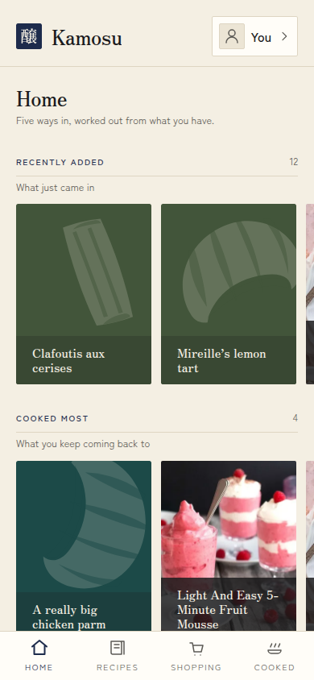
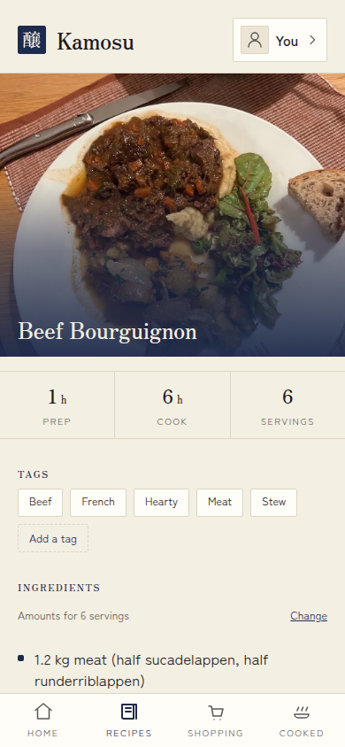
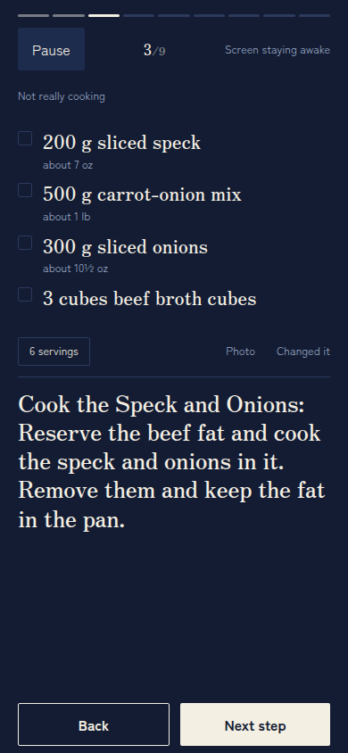
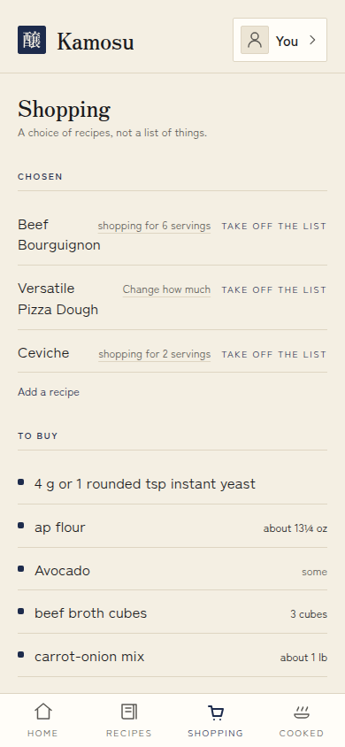

# Kamosu

A self-hosted cookbook that remembers what you cooked, and that an AI agent can
use as fully as you can.

Kamosu keeps your recipes, every change you ever made to them, each time you
cooked one and how it went, and the shopping list for the dishes you picked
this week. It runs on a machine you own, in one container with one folder and
one port, and it sends your data nowhere. Everything you can do in the web app
an agent can do over MCP (the Model Context Protocol), because both are built
from the same list of operations.

It was written for one household cooking from phones in a kitchen with bad
wifi, and it is shared in case it suits yours.

<p align="center">
  
  
  
  
</p>

## Highlights

- **Cook from your phone, offline.** Cooking mode walks you through the steps
  with the amounts each step needs, lets you tick off ingredients, and turns
  a time in the step text into a timer. Recipes stay readable with no signal, and what
  you record while offline is sent when the phone reconnects. Install it to
  your home screen like an app.
- **A recipe keeps its whole history.** Every save is a new version and none is
  ever lost. Start a variation beside the original, or a translation into
  another language, and Kamosu shows how they differ line by line.
- **A diary of what you cooked.** Each cooking is an Attempt: dated, rated,
  with photos, notes, and what you actually did if it differed from the
  recipe. Promote a change into the recipe when it earned its place.
- **The ingredient line stays exactly as you wrote it.** `2 poignées de farine,
  environ` is kept word for word. Kamosu reads the amount, unit and food out of
  it to scale the recipe, convert between metric and US measures, and add up a
  shopping list, and when it cannot read a line it leaves it alone.
- **A shopping list worked out from recipes.** Pick dishes and how many you are
  cooking for. Flour from three recipes becomes one row, added together where
  the units convert and shown side by side where they do not.
- **Bring your recipes in.** A web page (from its schema.org recipe data), a
  pasted recipe or a recipe PDF, a Crouton export, or a recipe file from
  another Kamosu. Importing the same thing twice matches what is already there
  instead of doubling it, and a recipe that changed at the source is offered
  for review, never written over.
- **Share without accounts.** A Share Link shows one recipe to anyone who has
  it, with a printable PDF Sheet and a recipe file another Kamosu can import
  with its full history.
- **A household, not a single user.** Everyone has their own Cookbook. A
  Kitchen is a group of people who cook from each other's Cookbooks, and two
  people can join their Cookbooks to write the same recipes together.
- **Agents are first-class.** Each person can create Access Keys, read-only or
  not, and connect an agent to `/mcp`. The agent gets every operation the web
  app uses, and nothing is web-only.
- **In English, French and Spanish.** Each person picks the language they
  read in, and a recipe can carry translations beside the original.

## Who it is for

Kamosu suits a person or a household that wants to keep its own recipes on its
own server, cooks from a phone, and would like an agent to be able to add, fix
or translate recipes for them.

It is not:

- **A hosted service.** There is no Kamosu cloud and no sync between servers.
  Recipes move between instances as files or Share Links.
- **A meal planner or nutrition tracker.** A recipe can carry one calorie
  figure you typed. Kamosu never calculates nutrition from ingredients.
- **A public recipe site.** There is no signup. Every account starts from an
  invite, and nothing is visible to strangers unless you share a link.
- **Finished.** This is 0.1.0. It is used in one kitchen, and nobody else has
  run it yet.

## Quick start

You need Docker (or Podman) and, to use it from a phone, a reverse proxy that
serves HTTPS. See [Why HTTPS is required](#why-https-is-required).

With Docker Compose, download [`docker-compose.yml`](docker-compose.yml) into an
empty folder and run:

```sh
mkdir -p kamosu-data && sudo chown 65532:65532 kamosu-data
docker compose up -d
```

Or with plain Docker:

```sh
mkdir -p kamosu-data && sudo chown 65532:65532 kamosu-data
docker run -d --name kamosu --restart unless-stopped \
  -v ./kamosu-data:/data -p 5266:5266 battermanz/kamosu:latest
```

Kamosu runs as user 65532 rather than root, which is why the folder has to
belong to that user.

Then open Kamosu and create the first account. **The first person to open it
becomes the Operator**, the account that invites everyone else. There is no
password in a log and no setup file. Do this straight after the first start.

Kamosu listens on port 5266 (it spells KAMO on a phone keypad).

### Why HTTPS is required

Kamosu serves plain HTTP and never handles a certificate. Put your own reverse
proxy (Caddy, Traefik, nginx) in front of it for HTTPS. This is not optional
for real use:

- The sign-in cookie is only ever sent over HTTPS, so over plain HTTP from
  another device you cannot stay signed in.
- Offline cooking needs a service worker, and browsers only run one over HTTPS.

To try it on the machine that runs it, `http://localhost:5266` works in Chrome
and Firefox, which treat `localhost` as secure.

The proxy only needs to pass requests through. Kamosu reads no forwarded
headers and trusts nothing a proxy adds.

### Podman

Kamosu builds and runs under rootless Podman. Give the folder to the container's
user with `podman unshare chown 65532:65532 kamosu-data` instead of `sudo
chown`. If you build the image yourself, use `podman build --format docker`,
or the health check is dropped.

## Connecting an agent

In Kamosu, open **Settings**, then **Access Keys**, and create one. Tick
**Read-only** if the agent only needs to look things up. The key is shown once.

Point your MCP client at `https://your-kamosu/mcp` and send the key as a bearer
token. For Claude Code:

```sh
claude mcp add --transport http kamosu https://your-kamosu/mcp \
  --header "Authorization: Bearer <your access key>"
```

An Access Key acts as you, in your Cookbook and every Kitchen you cook in. It
cannot create another key, change your password or invite a new account.
Revoke it from the same screen whenever you like; keys never expire on their
own.

Keep in mind that an agent reading a web page or someone else's recipe can be
given instructions by that text. A read-only key limits what that can cost.

## Your data

Everything Kamosu owns lives in the one folder mounted at `/data`: the SQLite
database, the photographs, the Backups, and the search model if you turn
Meaning Search on. **The database is the truth.** Losing it loses every
account, recipe history and shopping list.

- **Backups.** Kamosu takes its own and keeps three under `/data/backups`, one
  replaced every day, one every week and one every month, so you can reach
  back a day, a week or a month. Each is a zip of the database and the
  photographs. Kamosu never sends a Backup anywhere, so copy that folder off
  the machine with whatever already backs it up.
- **Restoring.** Stop Kamosu, delete `kamosu.db`, `kamosu.db-wal` and
  `kamosu.db-shm` from the folder, unzip a Backup over it, and start again.
- **Upgrading.** Pull the new image and restart. Kamosu copies the database to
  a Snapshot before it migrates, and migrations only go forward. There is no
  downgrade, so a Snapshot is the way back.
- **Taking recipes elsewhere.** Any recipe exports as a zip of readable
  Markdown notes with its full history, and prints as a PDF.

## Meaning Search is optional

Searching by words works from the first minute. Meaning Search finds "that
thing with aubergines" in a recipe that never says aubergine. It needs
Google's EmbeddingGemma model, which Kamosu does not ship and does not download
until an Operator accepts Google's terms in Settings.

Turning it on costs about 220 MB of disk, a few hundred megabytes of memory,
and a first index build of several minutes on a small machine. An instance
that leaves it off pays nothing for it, and turning it off deletes nothing
that cannot be rebuilt.

## Configuration

No environment variable is required.

| Variable | Default | Purpose |
| --- | --- | --- |
| `KAMOSU_ADDRESS` | `0.0.0.0` | Address to listen on. |
| `KAMOSU_PORT` | `5266` | Port to listen on. |
| `KAMOSU_DATA_DIR` | `/data` | The folder that holds everything. Inside the container, leave it alone and change the mount instead. |
| `KAMOSU_LOG` | `info` | Log level, as a `tracing` filter such as `debug` or `kamosu=debug,info`. |

## Troubleshooting

**I sign in and immediately land back on the sign-in page.** You are on plain
HTTP from another device, and the browser refuses the sign-in cookie. Reach
Kamosu through your HTTPS proxy.

**The container keeps restarting, and `docker logs kamosu` says `cannot open
/data`.** The mounted folder does not belong to user 65532. Run `sudo chown -R
65532:65532 kamosu-data` and start it again.

**The first time I opened Kamosu it said "Welcome back" instead of "Set up
Kamosu".** Someone or something created the first account before you did. The
instance holds nothing yet: stop it, empty the data folder, and start again.
Never keep an instance you did not set up yourself. [SECURITY.md](SECURITY.md)
explains how a web page can do this.

**I forgot my password and I am the only Operator.** Ask the server itself for
a one-use recovery link:

```sh
docker exec kamosu /app/kamosu recover "Your Name"
```

It prints a path starting `/recover/`. Open it after your Kamosu's address
(`https://your-kamosu/recover/...`) and choose a new password. Another Operator can also
send you one from the Operator screen.

**`docker ps` shows no health status under Podman.** The image was built in
Podman's default OCI format, which has no health check field. Rebuild with
`podman build --format docker`.

**A phone still shows an old version of a recipe.** Each phone keeps a copy of
the library for offline cooking. **Settings** says how many recipes it holds
and when they were last updated, and **Bring it up to date** refreshes them.

## Security

Authorisation happens in one place and depends only on who you signed in as.
Every secret is 256 bits and revocable one at a time, passwords need 15
characters, and URLs Kamosu fetches for you can only reach public addresses.
Kamosu has not been audited by anyone.

[SECURITY.md](SECURITY.md) has how to report a vulnerability, the full list of
what Kamosu defends, and the plain list of what it does not.

## Building from source

```sh
docker build -t kamosu .
```

The image is distroless (no shell, no package manager) and carries one binary
with the web app compiled into it. For development, see
[AGENTS.md](AGENTS.md): everything runs through [`just`](https://just.systems).
Design decisions and their reasons are in [`docs/adr/`](docs/adr/), and
[`CONTEXT.md`](CONTEXT.md) defines the words Kamosu uses.

## License

Kamosu is licensed under the [GNU Affero General Public License v3.0
only](LICENSE). Bundled fonts and the optional search model are covered in
[THIRD_PARTY_NOTICES.md](THIRD_PARTY_NOTICES.md).
